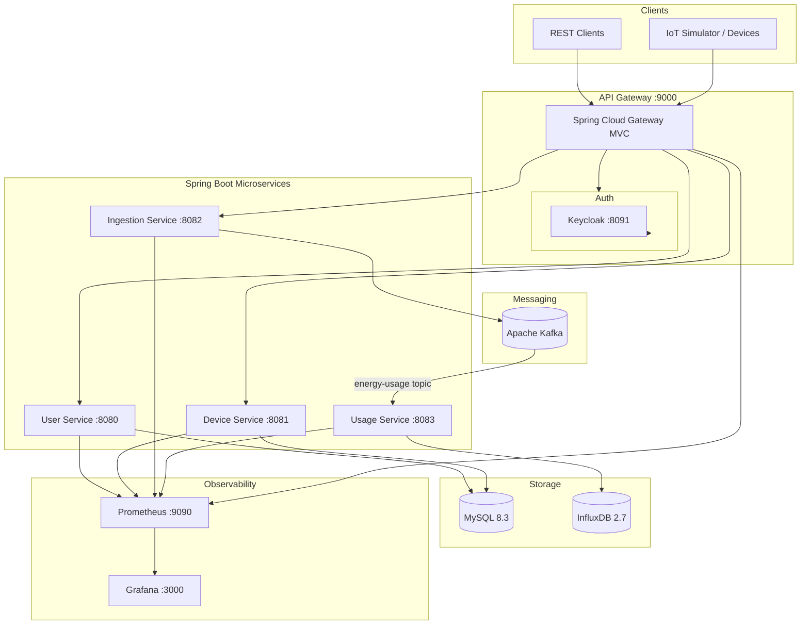

# Home Energy Tracker (HET)

A distributed **home energy monitoring platform** built with **Java microservices**. The system ingests IoT energy readings, streams them through **Apache Kafka**, stores time-series data in **InfluxDB**, and exposes a unified REST API through an **OAuth2-secured API Gateway**. Operational visibility is provided by **Prometheus** and **Grafana**.

---

## Table of Contents

- [Overview](#overview)
- [Architecture](#architecture)
- [Microservices](#microservices)
- [Technology Stack](#technology-stack)
- [Infrastructure & Tooling](#infrastructure--tooling)
- [Prerequisites](#prerequisites)
- [Getting Started](#getting-started)
- [Configuration Reference](#configuration-reference)
- [API Overview](#api-overview)
- [Data Flow](#data-flow)
- [Monitoring & Observability](#monitoring--observability)
- [IoT Data Simulation](#iot-data-simulation)
- [Project Structure](#project-structure)
- [Development](#development)
- [Security](#security)
- [Troubleshooting](#troubleshooting)
- [License](#license)

---

## Overview

Home Energy Tracker enables users to register smart home devices, ingest real-time energy consumption readings, and persist usage metrics for analytics and alerting. The platform follows a **microservices architecture** with clear separation of concerns:

| Concern | Service |
|---------|---------|
| Identity & access | API Gateway + Keycloak |
| User & device management | User Service, Device Service |
| Event ingestion | Ingestion Service |
| Time-series persistence | Usage Service + InfluxDB |
| Async messaging | Apache Kafka |

Infrastructure components (databases, message broker, monitoring) run in **Docker Compose**. Application microservices are designed to run on the **host machine** during local development, with Prometheus scraping them via `host.docker.internal`.

---

## Architecture



---

## Microservices

| Service | Port | Description | Key Dependencies |
|---------|------|-------------|------------------|
| **api-gateway** | `9000` | Single entry point for all external HTTP traffic. Routes requests to downstream services and enforces JWT authentication via Keycloak. | Spring Cloud Gateway MVC, OAuth2 Resource Server, Actuator, Micrometer |
| **user-service** | `8080` | Manages user profiles, contact information, and energy alert preferences (thresholds). | Spring Data JPA, Flyway, MySQL, Actuator, Micrometer |
| **device-service** | `8081` | CRUD operations for smart home devices (speakers, cameras, thermostats, etc.) linked to users. | Spring Data JPA, MySQL, Actuator, Micrometer |
| **ingestion-service** | `8082` | Accepts energy usage payloads via REST and publishes them to the `energy-usage` Kafka topic. | Spring Kafka, Jackson, Actuator, Micrometer |
| **usage-service** | `8083` | Consumes `energy-usage` events from Kafka and writes time-series points to InfluxDB. | Spring Kafka, InfluxDB Client, Springdoc OpenAPI, Actuator, Micrometer |

Each microservice is an independent **Maven** project with its own `pom.xml`, embedded test suite, and Spring Boot application entry point.

---

## Technology Stack

### Backend

| Technology | Version | Purpose |
|------------|---------|---------|
| Java | 26 | Runtime |
| Spring Boot | 4.0.x – 4.1.x | Application framework |
| Spring Cloud | 2025.1.2 | API Gateway (api-gateway) |
| Spring Data JPA | — | ORM for user & device data |
| Spring Kafka | — | Event streaming |
| Flyway | — | Database migrations (user-service) |
| Lombok | — | Boilerplate reduction |
| Micrometer + Prometheus Registry | — | Metrics export |
| Spring Boot Actuator | — | Health & metrics endpoints |
| Springdoc OpenAPI | 3.0.2 | API documentation (usage-service) |

### Data & Messaging

| Technology | Version | Purpose |
|------------|---------|---------|
| MySQL | 8.3.0 | Relational store (users, devices) |
| Apache Kafka | latest (KRaft) | Event bus (`energy-usage`, `energy-alerts`) |
| InfluxDB | 2.7 | Time-series energy usage storage |

### Security

| Technology | Version | Purpose |
|------------|---------|---------|
| Keycloak | 24.0.1 | Identity provider (OIDC / JWT) |
| Spring Security OAuth2 Resource Server | — | JWT validation at the gateway |

### Observability

| Technology | Version | Purpose |
|------------|---------|---------|
| Prometheus | 3.1.0 | Metrics collection & storage |
| Grafana | 11.4.0 | Dashboards & visualization |

### DevOps & Tooling

| Technology | Purpose |
|------------|---------|
| Docker Compose | Local infrastructure orchestration |
| Kafka UI (kafbat) | Kafka cluster management UI |
| Maven Wrapper (`mvnw`) | Consistent builds per service |
| Python + uv | IoT data simulation script |


---

## Prerequisites

- **Java 26** (JDK)
- **Docker** & **Docker Compose**
- **Maven** (or use the included `./mvnw` wrapper in each service)
- **Python 3.12+** and **[uv](https://docs.astral.sh/uv/)** (optional, for IoT simulation)

---

## Getting Started

### 1. Clone the repository

```bash
git clone <repository-url>
cd java_energy_tracker_microservice
```

### 2. Start infrastructure

```bash
docker compose up -d
```

Verify all containers are healthy:

```bash
docker compose ps
```

### 3. Build and run microservices

Each service is a standalone Maven project. From the repository root, start them in separate terminals:

```bash
# Terminal 1 — User Service
cd user-service && ./mvnw spring-boot:run

# Terminal 2 — Device Service
cd device-service && ./mvnw spring-boot:run

# Terminal 3 — Ingestion Service
cd ingestion-service && ./mvnw spring-boot:run

# Terminal 4 — Usage Service
cd usage-service && ./mvnw spring-boot:run

# Terminal 5 — API Gateway (start last)
cd api-gateway && ./mvnw spring-boot:run
```

> **Windows:** Use `mvnw.cmd` instead of `./mvnw`.

### 4. Verify services

| Check | URL |
|-------|-----|
| User Service health | http://localhost:8080/actuator/health |
| Device Service health | http://localhost:8081/actuator/health |
| Ingestion Service health | http://localhost:8082/actuator/health |
| Usage Service health | http://localhost:8083/actuator/health |
| API Gateway health | http://localhost:9000/actuator/health |
| Kafka UI | http://localhost:8070 |
| Keycloak Admin | http://localhost:8091 (admin / admin) |
| Prometheus | http://localhost:9090 |
| Grafana | http://localhost:3000 (admin / admin) |
| InfluxDB UI | http://localhost:8072 (admin / admin123) |

### 5. Run database migrations

Flyway migrations in **user-service** run automatically on startup and create the `user` and `device` tables.

---

## API Overview

All external traffic should go through the **API Gateway** at `http://localhost:9000`. Requests require a valid **JWT Bearer token** issued by Keycloak (except actuator endpoints depending on gateway rules).

### User Service — `/api/v1/user`

| Method | Endpoint | Description |
|--------|----------|-------------|
| `POST` | `/api/v1/user` | Create a user |
| `GET` | `/api/v1/user/{id}` | Get user by ID |
| `PUT` | `/api/v1/user/{id}` | Update user |
| `DELETE` | `/api/v1/user/{id}` | Delete user |

**User fields:** `name`, `surname`, `email`, `address`, `alerting`, `energyAlertingThreshold`

### Device Service — `/api/v1/device`

| Method | Endpoint | Description |
|--------|----------|-------------|
| `GET` | `/api/v1/device/{id}` | Get device by ID |
| `POST` | `/api/v1/device/create` | Create a device |
| `PUT` | `/api/v1/device/{id}` | Update device |
| `DELETE` | `/api/v1/device/{id}` | Delete device |

**Device types:** `SPEAKER`, `CAMERA`, `THERMOSTAT`, `LIGHT`, `LOCK`, `DOORBELL`

### Ingestion Service — `/api/v1/ingestion`

| Method | Endpoint | Description |
|--------|----------|-------------|
| `POST` | `/api/v1/ingestion` | Ingest an energy usage reading |

**Request body example:**

```json
{
  "deviceId": 1,
  "energyConsumed": 4.25,
  "timestamp": "2026-07-31T12:00:00Z"
}
```

### Usage Service

The usage service is **event-driven** (Kafka consumer) and does not expose business REST endpoints through the gateway. It exposes standard Actuator and Prometheus endpoints for monitoring.

---

## Data Flow

1. A client (or IoT simulator) sends a `POST` request to `/api/v1/ingestion` through the API Gateway with a JWT token.
2. The **ingestion-service** validates the payload and publishes an `EnergyUsageEvent` to the **`energy-usage`** Kafka topic.
3. The **usage-service** consumes the event and writes a data point to **InfluxDB**:
   - Measurement: `energy_usage`
   - Tag: `deviceId`
   - Field: `energyConsumed`
   - Timestamp: event timestamp (millisecond precision)
4. User and device metadata remain in **MySQL**, managed by their respective services.

---

## Monitoring & Observability

The platform uses the **Prometheus + Grafana** stack for metrics-based observability.

### Metrics collection

Every Spring Boot microservice exposes Prometheus metrics at:

```
/actuator/prometheus
```

Prometheus (running in Docker) scrapes all five services on the host via `host.docker.internal`. Scrape configuration: [`docker/prometheus/prometheus.yml`](docker/prometheus/prometheus.yml).

| Scrape Job | Target |
|------------|--------|
| user-service | `host.docker.internal:8080` |
| device-service | `host.docker.internal:8081` |
| ingestion-service | `host.docker.internal:8082` |
| usage-service | `host.docker.internal:8083` |
| api-gateway | `host.docker.internal:9000` |

Scrape interval: **15 seconds**. TSDB retention: **5 days**.

### Grafana dashboards

Grafana is pre-provisioned with:

- **Prometheus** as the default datasource ([`docker/grafana/provisioning/datasources/prometheus.yml`](docker/grafana/provisioning/datasources/prometheus.yml))
- **Home Energy Tracker - Overview** dashboard ([`docker/grafana/provisioning/dashboards/json/het-overview.json`](docker/grafana/provisioning/dashboards/json/het-overview.json))

Dashboard panels include:

| Panel | Metric |
|-------|--------|
| HTTP request rate | `rate(http_server_requests_seconds_count[5m])` by application |
| JVM heap used | Heap memory by application tag |
| Scrape target up | Service reachability (1 = up) |
| HTTP request rate by status | 2xx, 4xx, 5xx breakdown |
| Client error rate | 4xx responses |
| Server error rate | 5xx responses |
| Top endpoints | Request rate by URI, method, and status |

Access Grafana at **http://localhost:3000** (default login: `admin` / `admin`).

### Health checks

Each service exposes Spring Boot Actuator health endpoints:

```
GET /actuator/health
GET /actuator/info
GET /actuator/prometheus
```

### Kafka monitoring

Use **Kafka UI** at **http://localhost:8070** to inspect topics, consumer groups (e.g. `usage-service`), message throughput, and broker status.

---

## IoT Data Simulation

A Python-based simulator is included to generate realistic energy readings against the secured gateway.

**Location:** [`iot_data_simulation/`](iot_data_simulation/)

### Setup

```bash
cd iot_data_simulation
uv sync
```

### Run

1. Obtain a JWT access token from Keycloak (`energy-tracking` realm).
2. Set the token in [`iot_data_simulation/iot_data_simulation.py`](iot_data_simulation/iot_data_simulation.py).
3. Run the simulator:

```bash
uv run python iot_data_simulation.py
```

The script sends random energy readings for 100 simulated devices (IDs 1–100) to `http://localhost:9000/api/v1/ingestion` at ~2 requests/second.

---

## Project Structure

```
java_energy_tracker_microservice/
├── api-gateway/              # API Gateway (routing + JWT auth)
├── user-service/             # User management + Flyway migrations
├── device-service/           # Smart device management
├── ingestion-service/        # REST → Kafka producer
├── usage-service/            # Kafka → InfluxDB consumer
├── iot_data_simulation/      # Python IoT load generator
├── docker/
│   ├── mysql/                # Database init scripts
│   ├── prometheus/           # Prometheus scrape config
│   ├── grafana/              # Grafana provisioning & dashboards
│   └── keycloak/             # Realm import (energy-tracking)
├── docker-compose.yml        # Infrastructure orchestration
└── README.md
```

---

## Development

### Running tests

Each service includes a Spring Boot test suite. Run tests from the service directory:

```bash
cd user-service && ./mvnw test
```

### Database migrations

Schema changes for shared tables are managed via **Flyway** in `user-service`:

```
user-service/src/main/resources/db/migration/
├── V1__user_table.sql
└── V2__device_table.sql
```

### Adding a new microservice

1. Create a new Maven module following the existing service structure.
2. Add Actuator + Micrometer Prometheus dependencies.
3. Register the service port in [`docker/prometheus/prometheus.yml`](docker/prometheus/prometheus.yml).
4. Add a route in the API Gateway if the service should be externally accessible.

---

## Security

- **Authentication:** OAuth2 / OpenID Connect via **Keycloak** (`energy-tracking` realm).
- **Authorization:** The API Gateway validates JWTs on every request using the Keycloak JWK Set URI.
- **Gateway routes:** User, device, and ingestion endpoints are proxied through port `9000`.
- **Direct service access:** Microservices on ports `8080`–`8083` are reachable directly in local dev but should be protected behind the gateway in production.

### Obtaining a token (example)

```bash
curl -X POST "http://localhost:8091/realms/energy-tracking/protocol/openid-connect/token" \
  -H "Content-Type: application/x-www-form-urlencoded" \
  -d "grant_type=password" \
  -d "client_id=<client-id>" \
  -d "username=<username>" \
  -d "password=<password>"
```

Use the returned `access_token` as a `Bearer` token in the `Authorization` header.

---

## Troubleshooting

| Issue | Possible cause | Solution |
|-------|----------------|----------|
| Prometheus shows target `down` | Microservice not running on host | Start the service; confirm port matches `prometheus.yml` |
| Kafka connection refused | Wrong bootstrap server | Use `localhost:9094` from the host (external listener) |
| 401 Unauthorized on gateway | Missing or expired JWT | Obtain a fresh token from Keycloak |
| InfluxDB write failures | Token/org/bucket mismatch | Verify `application.properties` matches Docker Compose env vars |
| Grafana dashboard empty | Services not scraped yet | Wait 15–30s after starting all services |
| Keycloak realm not found | Realm import missing | Ensure `docker/keycloak/realms/` contains the `energy-tracking` realm export |

---

## Author

**Abhishek Tarun** — Home Energy Tracker Microservices Platform
